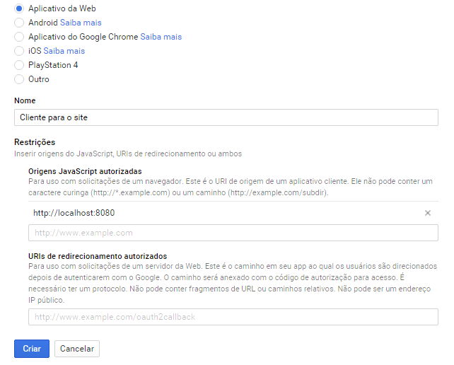
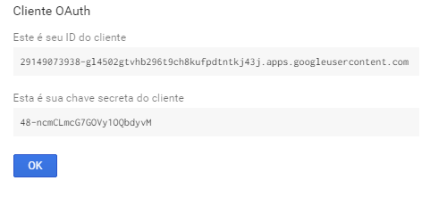

[](https://github.com/danielso2007/google-sign-in-javascript-client-reference/pulls)
[](https://github.com/danielso2007/google-sign-in-javascript-client-reference/issues?q=is%3Aopen+is%3Aissue)

[](https://github.com/danielso2007/google-sign-in-javascript-client-reference/pulls)


[](https://github.com/danielso2007/google-sign-in-javascript-client-reference/archive/master.zip)
[](https://conventionalcommits.org)

# Google Sign-In JavaScript client reference

Projeto simples utilizando métodos e atributos do cliente JavaScript para implementar o Login do Google em seus aplicativos da web.

## Getting Started

These instructions will get you a copy of the project up and running on your local machine for development and testing purposes. See deployment for notes on how to deploy the project on a live system.

### Prerequisites

Você deve ter instalado em seu sistema operacional:
- Nodejs [10.x, 12.x ou superior]
- npm
  - Gerenciador de Pacotes do Node (Node Package Manager)

### Installing

Instale os pacotes básicos apenas para iniciar um servidor local simples.

```
npm install
```

Neste momento será instalado o [http-server](https://www.npmjs.com/package/http-server) para executarmos os projeto, pois os testes de login sign in só são permitidos em um servidor e o endereço configurado em seu [Google Developer Console](https://console.developers.google.com/).

## Running the tests

Não há testes para esse web simples.

## Deployment

Para executar localmente, execute na raiz do projeto o comando:

```
npm run start
```

O servidor será instalado e será exibido:
```
Starting up http-server, serving ./
Available on:
  http://127.0.0.1:8080
  http://192.168.0.13:8080
  http://172.18.0.1:8080
Hit CTRL-C to stop the server
```

## Google Developer Console

Antes de integrar seu app com qualquer produto do Google é necessário criar um projeto e um client ID no Google Developer Console.

No endereço [Google Developer Console](https://console.developers.google.com/), crie ou selecione um projeto.

Vá em `Credenciais` e crie um `Create credentials` e selecione a opção `ID do cliente OAuth`.

Escolha `Aplicativo da web` e adicione em `Origens JavaScript autorizadas` todos os endereços permitidos para autenticação. No nosso projeto é de testes, adicionaremos o endereço `http://localhost:8080/`:



Após finalizar, são exibidos suas chaves:



Com o `ID do cliente` copiado, o mesmo deve ser adicionar no arquivo `scripts/scripts.js` substituindo o texto `<YOUR-CLIENT-ID>` pelo `ID do cliente` criado.

## References

* http://www.fabricadecodigo.com/adicionando-autenticacao-do-google-ao-seu-web-app/
* https://developers.google.com/identity/sign-in/web/reference